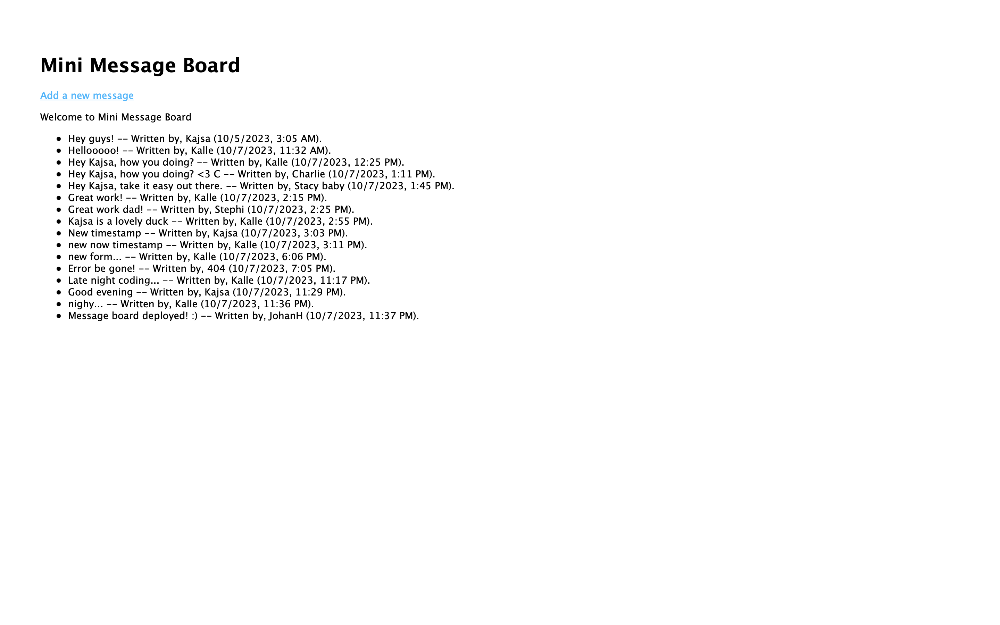

# mini-message-board
Project: Mini Message Board from TOP: NodeJS Course

[Live link to website](https://mini-message-board2023-5f5311c772ff.herokuapp.com)

## Mini Message Board built with:
- Node.js
- Express Framework
- API for CRUD Operations
- PUG template engine for views
- Setup, express-generator

## Homescreen

## Add new message

